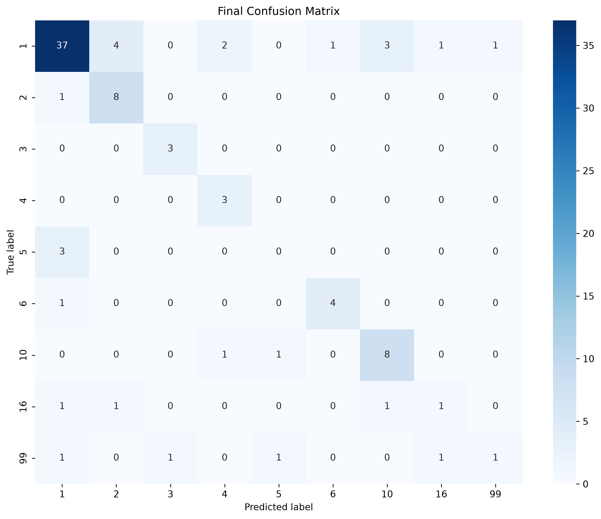
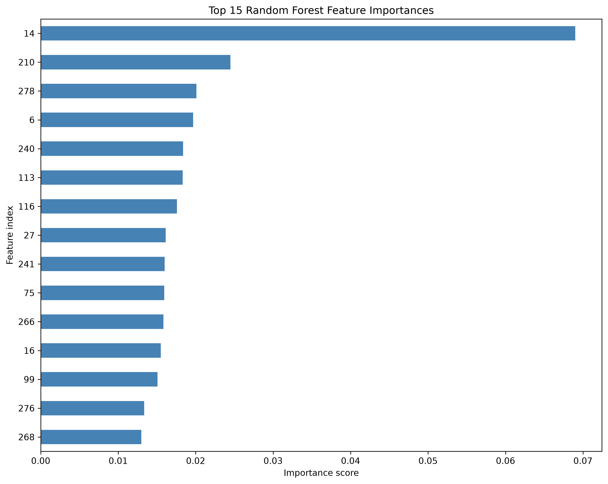

<div align="center">

# 💓 Cardiac Arrhythmia Classification from ECG Data

[](https://www.python.org/)
[](https://scikit-learn.org/)
[](https://jupyter.org/)
[](https://archive.ics.uci.edu/dataset/5/arrhythmia)
[](#-model-performance)

> Classifying ECG-derived clinical/signal features into one of 16 arrhythmia classes using classical ML — with a particular focus on doing imbalanced, high-dimensional, small-sample classification *rigorously*, including catching and documenting a data leakage bug that inflated an early PCA+SMOTE result from 0.40 to 0.98 macro-F1.

**Quick results:** tuned Random Forest, 0.637 macro-F1 (9-class) / 0.786 macro-F1 (binary sanity check) · PCA+SMOTE tried and rejected after a leakage fix dropped its score below the plain baseline.

</div>

---

## ⚠️ Disclaimer

> **This project is for educational purposes only.** It is a coursework/portfolio project, not a validated diagnostic tool, and should not be interpreted as clinically meaningful.

---

## 📌 Table of Contents

- [About the Project](#-about-the-project)
- [Dataset](#-dataset)
- [Class Distribution](#-class-distribution)
- [Methodology](#-methodology)
- [Model Performance](#-model-performance)
- [Key Findings](#-key-findings)
- [Project Structure](#-project-structure)
- [Getting Started](#-getting-started)
- [Tech Stack](#-tech-stack)
- [References](#-references)

---

## 🔬 About the Project

This project builds a classifier that predicts arrhythmia type from tabular ECG-derived features (not raw waveform signal), using the UCI Arrhythmia dataset. It mirrors the structure of a well-known reference implementation ([shsarv/Machine-Learning-Projects](https://github.com/shsarv/Machine-Learning-Projects)) but was built independently, milestone by milestone, with an emphasis on validating every preprocessing decision rather than assuming a technique helps just because it's commonly used.

**What this project covers:**
- Leakage-safe imputation, scaling, and class merging (fit only on training folds, never on validation/test)
- A documented, evidence-based rejection of PCA + SMOTE after discovering and fixing a cross-validation leakage bug
- A 6-model baseline comparison using stratified k-fold CV (not a single train/test split)
- Hyperparameter tuning via GridSearchCV on the top candidates
- A binary classification sanity check (arrhythmia present/absent) to contextualize the 9-class model's performance

---

## 📊 Dataset

| Property | Details |
|----------|---------|
| **Source** | [UCI Machine Learning Repository — Arrhythmia Dataset](https://archive.ics.uci.edu/dataset/5/arrhythmia) |
| **Samples** | 452 patient records |
| **Features** | 279 (age, sex, height, weight + 12-lead ECG signal attributes) |
| **Classes** | 16 original (1 Normal + 12 arrhythmia types + 3 unclassified/unused), merged to 9 for modeling |
| **Missing Values** | Encoded as `?` in the raw data; handled via median imputation |
| **Challenge** | 279 features vs. 452 samples (high dimensionality relative to sample count), severe class imbalance |

---

## 📋 Class Distribution

| Original class | Instances | Modeling label |
|:---:|:---:|:---|
| 1 (Normal) | 245 | 1 |
| 2 | 44 | 2 |
| 3 | 15 | 3 |
| 4 | 15 | 4 |
| 5 | 13 | 5 |
| 6 | 25 | 6 |
| 7 | 3 | merged → 99 |
| 8 | 2 | merged → 99 |
| 9 | 9 | merged → 99 |
| 10 | 50 | 10 |
| 14 | 4 | merged → 99 |
| 15 | 5 | merged → 99 |
| 16 (Unclassified) | 22 | 16 |
| 11, 12, 13 | 0 | absent from dataset |

> Classes 7, 8, 9, 14, and 15 had only 2–9 samples each — too few to appear reliably in both train and test folds under stratified splitting. They were merged into a single `other_arrhythmia` class (99) **before** the train/test split, so both folds share a consistent label definition.

---

## ⚙️ Methodology

```
Raw UCI Data (452 × 280, last column = label)
        │
        ▼
  Milestone 1 — Load & Clean
  ├── Convert '?' to NaN
  └── Split into X (279 features) and y (label)
        │
        ▼
  Milestone 2 — Split & Impute (leakage-safe)
  ├── Merge rare classes (7,8,9,14,15 → 99) BEFORE splitting
  ├── Stratified 80/20 train/test split
  └── Median imputation — fit on train only, applied to both
        │
        ▼
  Milestone 2 (extended) — PCA + SMOTE  ❌ REJECTED
  ├── Tried: StandardScaler → PCA (70 components, 90% variance) → SMOTE
  ├── First attempt leaked: SMOTE applied once before CV, inflating
  │   macro-F1 to ~0.98 via synthetic/real sample pairs split across folds
  └── Fixed (SMOTE inside each CV fold via imblearn.Pipeline): true
      macro-F1 was ~0.40 — WORSE than the plain baseline. Documented
      and set aside; not used downstream.
        │
        ▼
  Milestone 3 — Baseline Model Comparison
  ├── 6 models compared via stratified 5-fold CV (not a single split)
  ├── Logistic Regression, KNN, Decision Tree, Random Forest,
  │   Linear SVM, Kernel SVM (RBF) — all with class_weight="balanced"
  └── Random Forest wins: 0.759 accuracy / 0.611 macro-F1
        │
        ▼
  Milestone 4 — Hyperparameter Tuning
  ├── GridSearchCV on Random Forest, Linear SVM, Kernel SVM (RBF)
  └── Tuned Random Forest improves to 0.637 macro-F1
        │
        ▼
  Milestone 5 — Final Evaluation & Report
  └── Confusion matrix + feature importances on held-out test set
        │
        ▼
  Milestone 6 — Binary Sanity Check
  └── Arrhythmia present/absent: 0.786 macro-F1 (vs 0.637 for 9-class),
      confirming the pipeline is sound and the 9-class task is
      genuinely harder — not a bug.
```

---

## 📈 Model Performance

### Stratified 5-fold CV — raw imputed features, `class_weight="balanced"`

| Model | CV Accuracy | CV Macro-F1 |
|---|:---:|:---:|
| Logistic Regression | 0.600 | 0.485 |
| KNN | 0.595 | 0.266 |
| Decision Tree | 0.606 | 0.495 |
| **Random Forest** | **0.759** | **0.611** |
| Linear SVM | 0.655 | 0.503 |
| Kernel SVM (RBF) | 0.604 | 0.502 |

### After GridSearchCV tuning

| Model | Baseline Macro-F1 | Tuned Macro-F1 | Best hyperparameters |
|---|:---:|:---:|---|
| **Random Forest** | 0.611 | **0.637** | `max_depth=10, min_samples_leaf=4, n_estimators=100` |
| Linear SVM | 0.503 | 0.503 | `C=0.1` (no improvement) |
| Kernel SVM (RBF) | 0.502 | 0.546 | `C=100, gamma='scale'` |

### PCA + SMOTE — leakage before/after fix

| Version | CV Macro-F1 (Random Forest) |
|---|:---:|
| Leaked (SMOTE applied once, before CV split) | 0.979 |
| **Fixed** (SMOTE inside each CV fold) | **0.404** |
| Plain baseline (no PCA/SMOTE) | 0.611 |

### Binary sanity check (arrhythmia present vs. absent)

| Task | CV Macro-F1 | Held-out Test Accuracy |
|---|:---:|:---:|
| 9-class (tuned Random Forest) | 0.637 | 0.714 |
| Binary (same tuned config) | **0.786** | **0.846** |

> ✅ **Final selected model: tuned Random Forest** (`max_depth=10, min_samples_leaf=4, n_estimators=100, class_weight="balanced"`) — macro-F1 0.637, held-out test accuracy 0.714.

### Held-out test results (final model)

<p align="center">
  
  
</p>

> Heart rate (feature index 14) was by far the most important feature — roughly 3x more predictive than the next-ranked feature. The confusion matrix shows strong diagonal concentration for the larger classes (1, 2, 3, 4, 6, 10), with classes 5 and 16 remaining unreliable due to too few real training examples.

---

## 🔍 Key Findings

**PCA + SMOTE looked like a win — until cross-validation was done correctly.**
Applying SMOTE once to the full training set before running `StratifiedKFold` let synthetic samples generated from a real point land in a *different* CV fold than that real point. The model was effectively being validated on near-duplicates of its own training data, inflating macro-F1 to ~0.98. Moving SMOTE inside each fold (via `imblearn.pipeline.Pipeline`, which only resamples during `.fit()`, never during scoring) dropped the honest score to ~0.40 — below the plain baseline. This is documented as a rejected experiment rather than removed, since it's one of the most useful findings in the project.

**Class weighting outperformed more complex techniques.**
Simply telling Random Forest to weight minority-class errors more heavily (`class_weight="balanced"`) meaningfully improved recall on smaller classes (e.g. class 2: 0.56→0.89, class 6: 0.20→0.80) without the leakage risk or added complexity of resampling.

**Two classes never became reliably classifiable.**
Classes 5 (13 samples) and 16 (22 samples) stayed near-zero precision/recall across every experiment, including after tuning. With this few real examples, no technique tried here could teach the model a reliable pattern — a genuine data limitation, not a modeling failure.

**Heart rate was the single most important feature**, roughly 3x more predictive than the next-ranked feature — a clinically sensible result, though it also suggests the model may lean on one strong, simple signal rather than the finer waveform patterns a cardiologist would use.

**Binary framing confirmed the pipeline is sound.**
Collapsing to arrhythmia present/absent scored substantially higher (0.786 vs. 0.637 macro-F1) using the identical tuned model — confirming the 9-class task's lower score reflects genuine problem difficulty, not a broken pipeline.

---

## 🔭 Future Work

- **Two-stage classification:** given how much stronger the binary (present/absent) model performed, a first-stage "is arrhythmia present" classifier followed by a second-stage type classifier (only run on positive cases) may outperform a single 9-way classifier.
- **More data or class-specific collection:** classes 5 and 16 stayed unreliable across every technique tried here (imputation, class weighting, tuning, PCA, SMOTE) — the likely bottleneck is sample count (13 and 22 respectively), not modeling approach.
- **Signal-level features:** this project used only summary statistics from ECG leads (widths, amplitudes, angles), per the original PRD's scope. Raw waveform modeling (e.g. 1D CNNs on the underlying signal) is a natural, more data-hungry extension.
- **Revisit PCA with a supervised alternative:** since PCA optimizes for variance rather than class separability, a supervised dimensionality reduction method (e.g. LDA) might preserve more of the signal that actually separates rare classes.

---

## 📁 Project Structure

```
Cardiac Arrhythmia Classifier/
│
├── milestone1.py                        # Load raw data, convert '?' to NaN
├── milestone_02_split_and_impute.py     # Rare-class merge, stratified split, leakage-safe imputation
├── milestone_02b_pca_and_resampling.py  # PCA + SMOTE building blocks — REJECTED, kept for documentation
├── milestone_02c_full_pipeline.py       # Chains scale → PCA → SMOTE — REJECTED, kept for documentation
├── milestone_03_model_comparison.py     # 6-model stratified 5-fold CV comparison
├── milestone_04_tuning.py               # GridSearchCV tuning on top 3 candidates
├── milestone_05_final_report.ipynb      # Final model, confusion matrix, feature importances, written report
├── milestone_06_binary_classification.py # Binary sanity-check comparison
└── README.md
```

---

## 🚀 Getting Started

### 1. Set up environment

```bash
python -m venv .venv
source .venv/bin/activate        # macOS / Linux
.venv\Scripts\activate           # Windows

pip install scikit-learn imbalanced-learn matplotlib seaborn pandas
```

### 2. Run the milestones in order

```bash
./.venv/bin/python milestone_02_split_and_impute.py
./.venv/bin/python milestone_03_model_comparison.py
./.venv/bin/python milestone_04_tuning.py
jupyter notebook milestone_05_final_report.ipynb
./.venv/bin/python milestone_06_binary_classification.py
```

---

## 🛠️ Tech Stack

| Layer | Technology |
|-------|-----------|
| Language | Python 3.12 |
| ML Library | scikit-learn |
| Imbalance Handling | imbalanced-learn (SMOTE) — tried, evaluated, and rejected |
| Data Processing | Pandas, NumPy |
| Visualization | Matplotlib, Seaborn |
| Notebook | Jupyter (final report only) |

---

## 📚 References

- [UCI ML Repository — Arrhythmia Dataset](https://archive.ics.uci.edu/dataset/5/arrhythmia)
- Guvenir, H.A., et al. (1997). *A Supervised Machine Learning Algorithm for Arrhythmia Analysis.* Computers in Cardiology.
- Reference implementation for project structure: [shsarv/Machine-Learning-Projects — Classification of Arrhythmia \[ECG DATA\]](https://github.com/shsarv/Machine-Learning-Projects)
- [imbalanced-learn documentation](https://imbalanced-learn.org/stable/)
- [scikit-learn Pipeline documentation](https://scikit-learn.org/stable/modules/compose.html)
